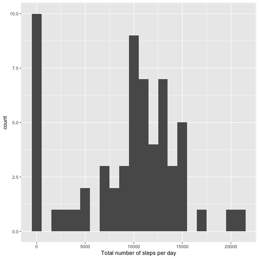
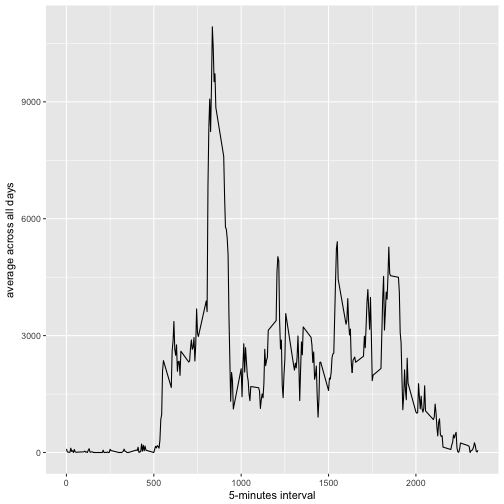
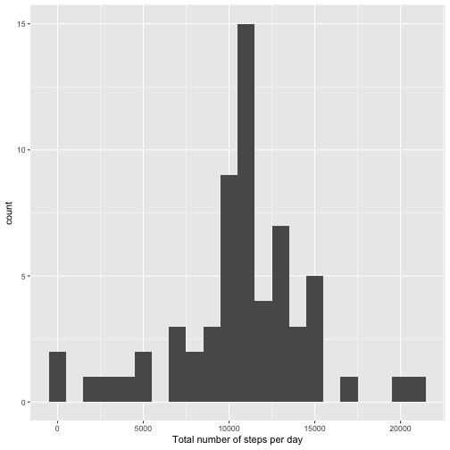
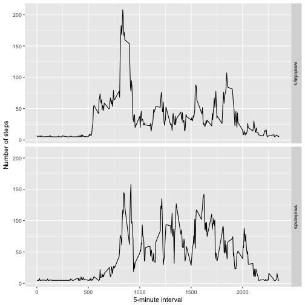

Reproducible Research Assignment 1
=====================================

# Load the data

```r
data <- read.csv("activity.csv", header = TRUE, sep=',')
head(data)
```

```
##   steps       date interval
## 1    NA 2012-10-01        0
## 2    NA 2012-10-01        5
## 3    NA 2012-10-01       10
## 4    NA 2012-10-01       15
## 5    NA 2012-10-01       20
## 6    NA 2012-10-01       25
```

# What is mean total number of steps taken per day?
1. Calculate the total number of steps taken per day

```r
totalsteps <- tapply(data$steps, data$date, FUN=sum, na.rm=TRUE)
head(totalsteps)
```

```
## 2012-10-01 2012-10-02 2012-10-03 2012-10-04 2012-10-05 2012-10-06 
##          0        126      11352      12116      13294      15420
```

```r
library(ggplot2)
qplot(totalsteps, binwidth=1000) + labs(x="Total number of steps per day")
```



3. Calculate the mean and median number of steps taken per day

```r
mean(totalsteps, na.rm=TRUE)
```

```
## [1] 9354.23
```

```r
median(totalsteps, na.rm=TRUE)
```

```
## [1] 10395
```

```r
summary(totalsteps, na.rm=TRUE)
```

```
##    Min. 1st Qu.  Median    Mean 3rd Qu.    Max. 
##       0    6778   10400    9354   12810   21190
```

# What is the average daily activity pattern?

1.Make a time series plot (i.e. 𝚝𝚢𝚙𝚎 = "𝚕") of the 5-minute interval (x-axis) and the average number of steps taken, averaged across all days (y-axis)

```r
average <- aggregate(x=list(steps=data$steps), by=list(interval=data$interval), FUN=sum, na.rm=TRUE)
head(average)
```

```
##   interval steps
## 1        0    91
## 2        5    18
## 3       10     7
## 4       15     8
## 5       20     4
## 6       25   111
```

```r
g <- ggplot(average, aes(interval, steps))
g + geom_line() + labs(x="5-minutes interval", y="average across all days")
```



2. Which 5-minute interval, on average across all the days in the dataset, contains the maximum number of steps?

```r
average.max <- average[which.max(average$steps),]
average.max
```

```
##     interval steps
## 104      835 10927
```

# Imputing missing values
1. Calculate and report the total number of missing values in the dataset (i.e. the total number of rows with 𝙽𝙰s)

```r
missingValue <- sum(is.na(data$steps))
missingValue
```

```
## [1] 2304
```

2. Devise a strategy for filling in all of the missing values in the dataset. The strategy does not need to be sophisticated. For example, you could use the mean/median for that day, or the mean for that 5-minute interval, etc.

```r
rm(missingValue)
na.position <- which(is.na(data$steps))
mean <- rep(mean(data$steps, na.rm=TRUE), time=length(na.position))
```

3. Create a new dataset that is equal to the original dataset but with the missing data filled in.

```r
data[na.position, "steps"] <- mean
rm(mean, na.position)
head(data)
```

```
##     steps       date interval
## 1 37.3826 2012-10-01        0
## 2 37.3826 2012-10-01        5
## 3 37.3826 2012-10-01       10
## 4 37.3826 2012-10-01       15
## 5 37.3826 2012-10-01       20
## 6 37.3826 2012-10-01       25
```

4. Make a histogram of the total number of steps taken each day and Calculate and report the mean and median total number of steps taken per day. Do these values differ from the estimates from the first part of the assignment? What is the impact of imputing missing data on the estimates of the total daily number of steps?

```r
fill.data <- aggregate(x=list(steps=data$steps), by=list(date=data$date), FUN=sum)
head(fill.data)
```

```
##         date    steps
## 1 2012-10-01 10766.19
## 2 2012-10-02   126.00
## 3 2012-10-03 11352.00
## 4 2012-10-04 12116.00
## 5 2012-10-05 13294.00
## 6 2012-10-06 15420.00
```

```r
qplot(fill.data$steps, binwidth=1000) + labs(x="Total number of steps per day")
```



```r
mean(fill.data$steps)
```

```
## [1] 10766.19
```

```r
median(fill.data$steps)
```

```
## [1] 10766.19
```

```r
summary(fill.data$steps)
```

```
##    Min. 1st Qu.  Median    Mean 3rd Qu.    Max. 
##      41    9819   10770   10770   12810   21190
```

# Are there differences in activity patterns between weekdays and weekends?
1. Create a new factor variable in the dataset with two levels – “weekday” and “weekend” indicating whether a given date is a weekday or weekend day.

```r
weekday.or.weekend <- function(date) {
    day <- weekdays(date)
    if (day %in% c("Monday", "Tuesday", "Wednesday", "Thursday", "Friday"))
        return("weekdays")
    else if (day %in% c("Saturday", "Sunday"))
        return("weekends")
    else
        stop("invalid date")
}
data$date <- as.Date(data$date)
data$day <- sapply(data$date, FUN=weekday.or.weekend)
average <- aggregate(x=list(steps=data$steps), 
                     by=list(interval=data$interval, day=data$day), 
                     FUN=mean)
head(average)
```

```
##   interval      day    steps
## 1        0 weekdays 7.006569
## 2        5 weekdays 5.384347
## 3       10 weekdays 5.139902
## 4       15 weekdays 5.162124
## 5       20 weekdays 5.073235
## 6       25 weekdays 6.295458
```

2. Make a panel plot containing a time series plot (i.e. 𝚝𝚢𝚙𝚎 = "𝚕") of the 5-minute interval (x-axis) and the average number of steps taken, averaged across all weekday days or weekend days (y-axis). See the README file in the GitHub repository to see an example of what this plot should look like using simulated data.

```r
g <- ggplot(average, aes(interval, steps), stat="identity")
g + geom_line() + facet_grid(day ~ .) +
    labs(x="5-minute interval", y="Number of steps")
```



